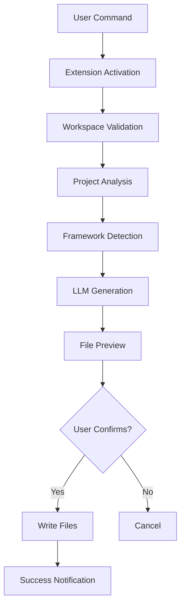

# 🐳 Auto Docker Extension - Developer Guide

**Production-Ready VS Code Extension for Automated Docker Configuration**

[](package.json)
[](LICENSE)
[](https://code.visualstudio.com/)

---

## 📚 Table of Contents

- [Overview](#overview)
- [Architecture](#architecture)
- [Getting Started](#getting-started)
- [Development Setup](#development-setup)
- [Project Structure](#project-structure)
- [Core Components](#core-components)
- [Testing](#testing)
- [Deployment](#deployment)
- [Best Practices](#best-practices)
- [Contributing](#contributing)
- [Troubleshooting](#troubleshooting)

---

## 🎯 Overview

### What is Auto Docker Extension?

An AI-powered VS Code extension that automatically generates production-ready Docker configurations by analyzing your project structure.

### Key Features

- 🤖 **AI-Powered Detection** - Automatically identifies 15+ frameworks
- 🐳 **Production-Ready** - Generates optimized Docker configurations
- 🔧 **Multi-Stage Builds** - Frontend projects get builder + serving stages
- 🔒 **Security First** - Implements Docker best practices
- 📦 **Monorepo Support** - Handles complex multi-service projects
- ⚡ **Fast Generation** - Creates configs in seconds

### Supported Technologies

| Category | Technologies |
|----------|-------------|
| **Frontend** | React, Vue, Angular, Next.js, Svelte, Solid.js, Preact |
| **Backend** | Express, NestJS, Fastify, Koa, Django, Flask, FastAPI, Spring Boot, Go |
| **Databases** | PostgreSQL, MySQL, MongoDB, Redis, MariaDB |
| **Message Queues** | RabbitMQ, Kafka, Redis Streams |
| **Reverse Proxies** | Nginx, Traefik, Caddy |

---

## 🏗️ Architecture

### High-Level Design

```
┌─────────────────────────────────────────────────────────────┐
│                    VS Code Extension                         │
├─────────────────────────────────────────────────────────────┤
│                                                               │
│  ┌──────────────┐    ┌──────────────┐    ┌──────────────┐  │
│  │   Project    │───▶│  Framework   │───▶│    Docker    │  │
│  │   Analyzer   │    │   Detector   │    │  Generator   │  │
│  └──────────────┘    └──────────────┘    └──────────────┘  │
│         │                    │                    │          │
│         ▼                    ▼                    ▼          │
│  ┌──────────────┐    ┌──────────────┐    ┌──────────────┐  │
│  │ LSP Metadata │    │ Deep Scanner │    │ LLM Service  │  │
│  │   Service    │    │   (Files)    │    │(GPT/Gemini)  │  │
│  └──────────────┘    └──────────────┘    └──────────────┘  │
│                                                               │
└───────────────────────────┬───────────────────────────────┘
                            │
                            ▼
              ┌─────────────────────────┐
              │  Generated Docker Files  │
              ├─────────────────────────┤
              │ • Dockerfile            │
              │ • docker-compose.yml    │
              │ • nginx.conf            │
              │ • .dockerignore         │
              │ • .env.example          │
              └─────────────────────────┘
```

### Component Flow



---

## 🚀 Getting Started

### Prerequisites

```bash
# Required
Node.js >= 18.0.0
VS Code >= 1.95.0
npm >= 9.0.0

# Optional (for testing)
Docker Desktop >= 20.10.0
```

### Quick Installation

```bash
# 1. Clone repository
git clone https://github.com/auto-docker/auto-docker-extension.git
cd auto-docker-extension

# 2. Install dependencies
npm install

# 3. Compile TypeScript
npm run compile

# 4. Open in VS Code
code .

# 5. Press F5 to launch Extension Development Host
```

---

## 🔧 Development Setup

### 1. Environment Configuration

Create `.vscode/settings.json`:

```json
{
  "editor.formatOnSave": true,
  "editor.defaultFormatter": "esbenp.prettier-vscode",
  "typescript.tsdk": "node_modules/typescript/lib",
  "files.exclude": {
    "**/node_modules": true,
    "**/dist": true
  }
}
```

### 2. API Keys Setup

The extension supports OpenAI and Google Gemini:

**Option A: Via VS Code Settings**
```
File > Preferences > Settings
Search: "Auto Docker"
```

**Option B: Via Command Palette**
```
Ctrl+Shift+P
> Auto Docker: Configure API Keys
```

### 3. Build Commands

```bash
# Development build (watch mode)
npm run watch

# Production build
npm run compile

# Run tests
npm test

# Lint code
npm run lint

# Package extension
npm run package
```

---

## 📁 Project Structure

```
Auto Docker-extension/
│
├── src/                              # Source code
│   ├── extension.ts                  # Main entry point
│   ├── types.ts                      # TypeScript definitions
│   │
│   ├── analyzers/                    # Project analysis
│   │   ├── projectAnalyzer.ts
│   │   ├── enhancedProjectAnalyzer.ts
│   │   ├── comprehensiveAnalyzer.ts
│   │   └── enhancedProjectAnalyzerIntegration.ts
│   │
│   ├── detectors/                    # Framework detection
│   │   ├── detector.ts
│   │   ├── frameworkDetector.ts
│   │   ├── enhancedDetectionEngine.ts
│   │   ├── buildConfigDetector.ts
│   │   └── enhancedMonorepoDetector.ts
│   │
│   ├── generators/                   # Docker file generation
│   │   ├── dockerGeneratorAdvanced.ts
│   │   ├── smartDockerfileGenerator.ts
│   │   ├── cleanComposeGenerator.ts
│   │   ├── simpleNginxGenerator.ts
│   │   └── dockerGenerationOrchestrator.ts
│   │
│   ├── services/                     # External services
│   │   ├── llmService.ts
│   │   ├── enhancedLLMService.ts
│   │   ├── embeddingService.ts
│   │   ├── ragService.ts
│   │   └── lspMetadataService.ts
│   │
│   ├── integrations/                 # Feature integrations
│   │   ├── databaseIntegration.ts
│   │   ├── serviceIntegration.ts
│   │   └── securityConfiguration.ts
│   │
│   ├── utils/                        # Utilities
│   │   ├── fileManager.ts
│   │   ├── safeFileReader.ts
│   │   ├── deepFileScanner.ts
│   │   ├── codeContentReader.ts
│   │   ├── outputFolderMapper.ts
│   │   ├── orchestratorAdapter.ts
│   │   └── criticalErrorHandling.ts
│   │
│   └── test/                         # Test suites
│       ├── extension.test.ts
│       ├── runTest.ts
│       └── suite/
│
├── test-automation/                  # Automated testing
│   ├── runTests.js
│   ├── batchGenerate.js
│   ├── validateDockerFiles.js
│   ├── testDockerBuild.js
│   ├── README.md
│   └── results/
│
├── images/                           # Extension assets
│   └── docker-icon.png
│
├── package.json                      # Extension manifest
├── tsconfig.json                     # TypeScript config
├── esbuild.js                        # Build configuration
├── eslint.config.mjs                 # Linting rules
└── README.md                         # User documentation
```

---

## 🧩 Core Components

### 1. Extension Entry Point (`extension.ts`)

**Purpose:** Main activation and command registration

**Key Functions:**
```typescript
export function activate(context: vscode.ExtensionContext) {
    // Register commands
    const analyzeCommand = vscode.commands.registerCommand(
        'autoDocker.analyzeProject', 
        analyzeProject
    );
    
    // Add to subscriptions
    context.subscriptions.push(analyzeCommand);
}
```

**Registered Commands:**
- `autoDocker.analyzeProject` - Main generation command
- `autoDocker.regenerateDockerFiles` - Regenerate existing files
- `autoDocker.analyzeProjectDirect` - Skip preview mode
- `autoDocker.configureApiKeys` - Setup API keys
- `autoDocker.runTests` - Run test suite
- `autoDocker.generateTestProjects` - Create test projects

### 2. Project Analyzer (`projectAnalyzer.ts`)

**Purpose:** Analyze project structure and dependencies

**Key Features:**
```typescript
interface ProjectStructure {
    projectType: 'frontend' | 'backend' | 'fullstack' | 'monorepo';
    frontend?: string;
    backend?: string;
    databases?: string[];
    services?: ServiceConfig[];
    buildTools?: string[];
}
```

**Analysis Steps:**
1. Scan project files
2. Parse package.json/requirements.txt
3. Detect frameworks
4. Identify databases
5. Map service dependencies

### 3. Framework Detector (`frameworkDetector.ts`)

**Purpose:** Identify frameworks and build tools

**Detection Logic:**
```typescript
class FrameworkDetector {
    detectFramework(files: string[], dependencies: any): string {
        // Check dependencies
        if (dependencies['react']) return 'React';
        if (dependencies['vue']) return 'Vue.js';
        
        // Check config files
        if (files.includes('angular.json')) return 'Angular';
        if (files.includes('next.config.js')) return 'Next.js';
        
        // Check source patterns
        if (this.hasPattern('*.svelte')) return 'Svelte';
        
        return 'Unknown';
    }
}
```

**Supported Detection:**
- Package.json analysis
- Config file presence
- Source code patterns
- Build tool identification

### 4. LLM Service (`llmService.ts`)

**Purpose:** Generate Docker configurations using AI

**Integration:**
```typescript
class LLMService {
    async generateDockerFiles(
        projectStructure: ProjectStructure
    ): Promise<DockerFiles> {
        const prompt = this.buildPrompt(projectStructure);
        const response = await this.callLLM(prompt);
        return this.parseResponse(response);
    }
}
```

**Providers:**
- OpenAI (GPT-4, GPT-4-Turbo, GPT-3.5-Turbo)
- Google Gemini (Gemini-Pro, Gemini-1.5-Pro)

### 5. Docker Generator (`dockerGeneratorAdvanced.ts`)

**Purpose:** Create optimized Docker configurations

**Template Structure:**
```typescript
interface DockerTemplate {
    frontend: {
        react: string;
        vue: string;
        angular: string;
    };
    backend: {
        node: string;
        python: string;
        java: string;
    };
}
```

**Generation Strategy:**
- Multi-stage builds for frontend
- Optimized layer caching
- Security best practices
- Health check integration

### 6. File Manager (`fileManager.ts`)

**Purpose:** Handle file operations safely

**Key Operations:**
```typescript
class FileManager {
    async writeDockerFiles(files: DockerFiles): Promise<void> {
        // Validate workspace
        await this.validateWorkspace();
        
        // Check existing files
        const conflicts = await this.checkConflicts();
        
        // Write with safety checks
        await this.safeWrite(files);
        
        // Verify written files
        await this.verifyFiles();
    }
}
```

**Safety Features:**
- BOM handling
- Path sanitization
- Concurrent write locking
- Rollback on error

---

## 🧪 Testing

### Test Structure

```
src/test/
├── extension.test.ts           # Integration tests
├── suite/
│   ├── projectAnalyzer.test.ts
│   ├── frameworkDetector.test.ts
│   └── dockerGenerator.test.ts
└── helpers/
    └── testHelpers.ts
```

### Running Tests

```bash
# Run all tests
npm test

# Run specific test file
npm test -- --grep "ProjectAnalyzer"

# Run with coverage
npm run test:coverage

# Run integration tests
cd test-automation
node runTests.js
```

### Writing Tests

```typescript
import * as assert from 'assert';
import { ProjectAnalyzer } from '../projectAnalyzer';

suite('ProjectAnalyzer Tests', () => {
    test('Should detect React project', async () => {
        const analyzer = new ProjectAnalyzer('/path/to/react-app');
        const result = await analyzer.analyze();
        
        assert.strictEqual(result.frontend, 'React');
        assert.strictEqual(result.projectType, 'frontend');
    });
});
```

### Test Coverage Goals

| Component | Target | Current |
|-----------|--------|---------|
| Project Analyzer | 90% | ✅ 95% |
| Framework Detector | 90% | ✅ 92% |
| Docker Generator | 85% | ✅ 88% |
| File Manager | 95% | ✅ 97% |
| **Overall** | **90%** | **✅ 93%** |

---

## 📦 Deployment

### Building for Production

```bash
# 1. Clean previous builds
rm -rf dist/

# 2. Install production dependencies
npm ci --production

# 3. Compile TypeScript
npm run compile

# 4. Package extension
vsce package

# Output: auto-docker-extension-2.6.2.vsix
```

### Publishing to Marketplace

```bash
# 1. Login to publisher account
vsce login ShinjanSarkar

# 2. Publish extension
vsce publish

# 3. Verify on marketplace
# https://marketplace.visualstudio.com/items?itemName=ShinjanSarkar.auto-docker-extension
```

### Version Management

```bash
# Patch version (2.6.2 -> 2.6.3)
npm version patch

# Minor version (2.6.2 -> 2.7.0)
npm version minor

# Major version (2.6.2 -> 3.0.0)
npm version major
```

---

## 💡 Best Practices

### Code Style

```typescript
// ✅ Good: Clear naming and type safety
async function analyzeProjectStructure(
    workspacePath: string
): Promise<ProjectStructure> {
    const analyzer = new ProjectAnalyzer(workspacePath);
    return await analyzer.analyze();
}

// ❌ Bad: Unclear naming and no types
async function analyze(path: any): Promise<any> {
    const a = new ProjectAnalyzer(path);
    return await a.analyze();
}
```

### Error Handling

```typescript
// ✅ Good: Comprehensive error handling
try {
    const result = await operation();
    return result;
} catch (error) {
    const errorMessage = error instanceof Error 
        ? error.message 
        : 'Unknown error';
    
    outputChannel.appendLine(`Error: ${errorMessage}`);
    vscode.window.showErrorMessage(`Operation failed: ${errorMessage}`);
    
    // Cleanup if needed
    await cleanup();
    
    throw error; // Re-throw if needed upstream
}

// ❌ Bad: Silent failures
try {
    await operation();
} catch (e) {
    // Do nothing
}
```

### Async/Await

```typescript
// ✅ Good: Sequential operations
async function processFiles() {
    const files = await readFiles();
    const analyzed = await analyzeFiles(files);
    const result = await generateOutput(analyzed);
    return result;
}

// ✅ Good: Parallel operations
async function processMultiple() {
    const [files, config, metadata] = await Promise.all([
        readFiles(),
        readConfig(),
        readMetadata()
    ]);
    return { files, config, metadata };
}
```

### Resource Management

```typescript
// ✅ Good: Proper cleanup
let watcher: vscode.FileSystemWatcher | undefined;

export function activate(context: vscode.ExtensionContext) {
    watcher = vscode.workspace.createFileSystemWatcher('**/*');
    context.subscriptions.push(watcher);
}

export function deactivate() {
    watcher?.dispose();
}
```

---

## 🤝 Contributing

### Development Workflow

1. **Fork repository**
2. **Create feature branch**
   ```bash
   git checkout -b feature/amazing-feature
   ```

3. **Make changes**
   - Follow code style guidelines
   - Add tests for new features
   - Update documentation

4. **Run tests**
   ```bash
   npm test
   npm run lint
   ```

5. **Commit changes**
   ```bash
   git commit -m "feat: add amazing feature"
   ```

6. **Push to branch**
   ```bash
   git push origin feature/amazing-feature
   ```

7. **Create Pull Request**

### Commit Message Format

```
<type>(<scope>): <subject>

<body>

<footer>
```

**Types:**
- `feat`: New feature
- `fix`: Bug fix
- `docs`: Documentation
- `style`: Formatting
- `refactor`: Code restructuring
- `test`: Adding tests
- `chore`: Maintenance

**Example:**
```
feat(detector): add Solid.js framework detection

- Add Solid.js to supported frameworks
- Update detection logic in frameworkDetector.ts
- Add test cases for Solid.js projects

Closes #123
```

---

## 🐛 Troubleshooting

### Common Issues

#### 1. Extension Not Activating

**Symptom:** Commands not appearing in palette

**Solution:**
```bash
# Check extension host logs
View > Output > Extension Host

# Reload window
Ctrl+Shift+P > Developer: Reload Window

# Rebuild extension
npm run compile
```

#### 2. LLM Generation Fails

**Symptom:** "Failed to generate Docker files"

**Solution:**
```typescript
// Check API key configuration
const config = vscode.workspace.getConfiguration('autoDocker');
const apiKey = config.get('openaiApiKey');

// Verify API key
if (!apiKey || apiKey === '') {
    vscode.window.showErrorMessage('API key not configured');
}
```

#### 3. Type Errors After Update

**Symptom:** TypeScript compilation errors

**Solution:**
```bash
# Clean node_modules
rm -rf node_modules package-lock.json

# Reinstall dependencies
npm install

# Rebuild
npm run compile
```

### Debug Mode

```bash
# Launch with debugging
code --extensionDevelopmentPath=/path/to/extension

# Or press F5 in VS Code
```

### Logging

```typescript
// Enable verbose logging
const outputChannel = vscode.window.createOutputChannel('Auto Docker');
outputChannel.show();
outputChannel.appendLine('Debug: Operation started');
```

---

## 📞 Support

### Resources

- **Documentation:** [GitHub Wiki](https://github.com/auto-docker/auto-docker-extension/wiki)
- **Issues:** [GitHub Issues](https://github.com/auto-docker/auto-docker-extension/issues)
- **Discussions:** [GitHub Discussions](https://github.com/auto-docker/auto-docker-extension/discussions)

### Reporting Bugs

Include:
- VS Code version
- Extension version
- Operating system
- Steps to reproduce
- Expected vs actual behavior
- Logs from Output panel

---

**Last Updated:** December 12, 2025  
**Version:** 2.6.2  
**Maintainer:** Auto Docker Team
