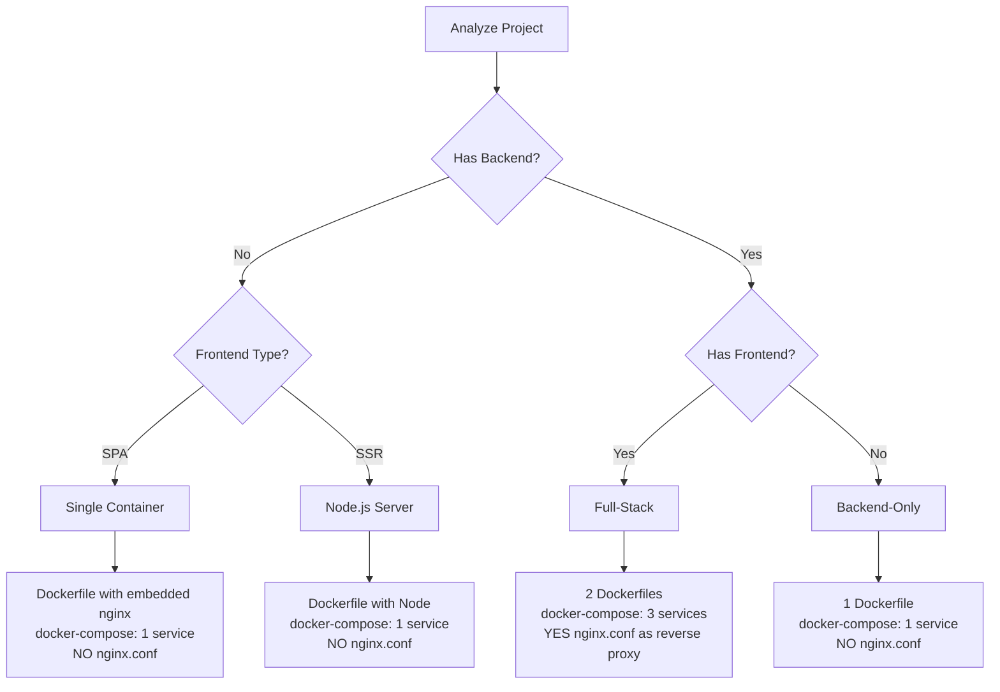

# AutoDocker Policy Implementation Guide

## 🎯 Policy Rules Implementation Status

This document shows exactly how the AutoDocker Reverse Proxy Policy has been implemented in the codebase.

---

## 1. Frontend-Only Template Implementation

### ✅ Dockerfile Generation
**File:** `src/dockerGeneratorAdvanced.ts` (Lines 66-140)

**Implementation:**
```typescript
// Stage 1: Build
FROM node:18-alpine AS builder
WORKDIR /app
COPY package*.json ./
RUN npm ci
COPY . .
RUN npm run build

// Stage 2: Production nginx with EMBEDDED config
FROM nginx:stable-alpine
RUN rm /etc/nginx/conf.d/default.conf

// EMBEDDED NGINX CONFIG (NO external file needed)
RUN echo 'server {' > /etc/nginx/conf.d/default.conf && \
    echo '  listen 80;' >> /etc/nginx/conf.d/default.conf && \
    // ... production config with security headers, gzip, SPA routing
    
COPY --from=builder /app/dist .
EXPOSE 80
CMD ["nginx", "-g", "daemon off;"]
```

### ✅ Docker Compose Generation
**File:** `src/llmService.ts` (Lines 1315-1342)

**Implementation:**
```typescript
// Frontend-only: SINGLE container on port 80
if (projectStructure.frontend && !isSsr && !projectStructure.backend) {
    return `services:
  web:
    build: .
    ports:
      - "80:80"  // Direct port 80 exposure
    restart: unless-stopped
    healthcheck:
      test: ["CMD", "wget", "--quiet", "--tries=1", "--spider", "http://localhost/"]`;
}
```

### ✅ Nginx.conf Logic
**File:** `src/fileManager.ts` (Lines 34-48)

**Implementation:**
```typescript
// POLICY: Only write nginx.conf for full-stack/monorepo
if (dockerFiles.nginxConf && projectStructure) {
    const isFrontendOnly = projectStructure.frontend && !projectStructure.backend;
    const isFullStack = projectStructure.frontend && projectStructure.backend;
    
    // Frontend-only: NO nginx.conf (embedded in Dockerfile)
    if (isFullStack || isMonorepo) {
        filesToWrite.push({ name: 'nginx.conf', content: dockerFiles.nginxConf });
    }
}
```

**Result:** ✅ Frontend-only projects get SINGLE container with embedded nginx, NO external nginx.conf

---

## 2. Full-Stack Template Implementation

### ✅ Docker Compose Generation
**File:** `src/llmService.ts` (Lines 1344-1418)

**Implementation:**
```typescript
// Full-stack: THREE containers (frontend, backend, nginx)
if (projectStructure.frontend && projectStructure.backend) {
    return `services:
  frontend:
    build: ./frontend
    networks:
      - app-network
    # NO port exposure to host
    
  backend:
    build: ./backend
    networks:
      - app-network
    # NO port exposure to host
    
  nginx:
    image: nginx:stable-alpine
    ports:
      - "80:80"  # Only nginx exposed to host
      - "443:443"
    volumes:
      - ./nginx.conf:/etc/nginx/conf.d/default.conf:ro
    depends_on:
      - frontend
      - backend
    networks:
      - app-network`;
}
```

### ✅ Nginx Reverse Proxy Config
**File:** `src/llmService.ts` (Lines 1630-1680)

**Implementation:**
```typescript
private generateFallbackNginx(projectStructure?: ProjectStructure): string {
    // POLICY: Only for full-stack/monorepo
    if (!projectStructure?.backend) {
        return ''; // No nginx.conf for frontend-only
    }
    
    return `server {
    listen 80;
    
    # Frontend - SPA routing
    location / {
        try_files $uri $uri/ /index.html;
    }
    
    # Backend API proxy
    location /api/ {
        proxy_pass http://backend:${backendPort}/;
        proxy_set_header Host $host;
        proxy_set_header X-Real-IP $remote_addr;
        // ... WebSocket support, proxy headers
    }`;
}
```

**Result:** ✅ Full-stack projects get THREE containers with nginx as reverse proxy

---

## 3. Backend-Only Template Implementation

### ✅ Docker Compose Generation
**File:** `src/llmService.ts` (Lines 1419-1445)

**Implementation:**
```typescript
// Backend-only: Direct API port exposure
else {
    return `services:
  app:
    build: .
    ports:
      - "${appPort}:${appPort}"  // Direct port exposure (3000/5000/8000)
    restart: unless-stopped
    env_file:
      - .env`;
}
```

### ✅ Backend Dockerfiles
**File:** `src/dockerGeneratorAdvanced.ts` (Lines 200-400)

**Implementation:**
- Node.js: Multi-stage with alpine (Lines 181-238)
- Python: Multi-stage with slim (Lines 240-310)
- Go: Multi-stage with scratch (Lines 312-365)
- Java: Multi-stage with JRE (Lines 367-420)

**Result:** ✅ Backend-only projects expose API port directly, NO nginx

---

## 4. LLM Prompt Policy Enforcement

### ✅ Policy-Based Prompts
**File:** `src/llmService.ts` (Lines 502-620)

**Implementation:**
```typescript
private createPrompt(projectStructure: ProjectStructure): string {
    return `
🔴 POLICY RULES (MUST FOLLOW):

${isFrontend && !projectStructure.backend ? `
=== FRONTEND-ONLY PROJECT ===
- Multi-stage: node builder -> nginx:stable-alpine
- EMBED nginx config in Dockerfile (NO external file)
- docker-compose: SINGLE service on port 80
- NO /api/ proxy
` : ''}

${projectStructure.backend && projectStructure.frontend ? `
=== FULL-STACK PROJECT ===
- THREE services (frontend, backend, nginx)
- nginx as reverse proxy
- ONLY nginx exposes port 80
- nginx.conf: location / -> frontend, location /api/ -> backend
` : ''}

${projectStructure.backend && !projectStructure.frontend ? `
=== BACKEND-ONLY PROJECT ===
- SINGLE service exposing API port
- NO nginx.conf needed
` : ''}`;
}
```

**Result:** ✅ LLM generates policy-compliant files based on project type

---

## 5. Enhanced Codebase Analysis

### ✅ Deep Intelligence Analysis
**File:** `src/comprehensiveAnalyzer.ts` (Lines 760-890)

**Implementation:**
```typescript
async analyzeWithDeepIntelligence(): Promise<{
    projectType: string;
    confidence: number;
    recommendations: string[];
    detectedPatterns: string[];
}> {
    // Analyze frontend patterns
    if (analysis.frontends.length > 0) {
        // Detect SPA vs SSR
        if (['nextjs', 'nuxt', 'sveltekit'].includes(framework)) {
            patterns.push('SSR Framework - requires Node.js runtime');
            recommendations.push('Use Node.js server, NOT nginx');
        } else {
            patterns.push('SPA Framework - static build');
            recommendations.push('Use multi-stage with nginx:stable-alpine');
            recommendations.push('Embed nginx config in Dockerfile');
        }
    }
    
    // Full-stack detection
    if (frontends.length > 0 && backends.length > 0) {
        patterns.push('Full-stack project detected');
        recommendations.push('Use nginx as reverse proxy');
        recommendations.push('Three-container architecture');
        confidence = 0.9;
    }
}
```

**Result:** ✅ Gemini-level code understanding with confidence scores and recommendations

---

## 6. Policy Decision Matrix

| Project Type | Nginx Location | Containers | Port 80 Exposed By | nginx.conf File |
|--------------|----------------|------------|-------------------|-----------------|
| Frontend-only (React/Vue/Angular) | Embedded in Dockerfile | 1 (web) | web container | ❌ NO (embedded) |
| SSR (Next.js/Nuxt) | NOT used | 1 (app) | app container | ❌ NO |
| Backend-only (Express/FastAPI) | NOT used | 1 (app) | app container | ❌ NO |
| Full-stack | Reverse proxy | 3 (frontend, backend, nginx) | nginx container | ✅ YES (separate file) |
| Monorepo | Gateway | N+1 (services + nginx) | nginx container | ✅ YES (separate file) |

---

## 7. File Output Decision Tree



---

## 8. Testing Checklist

### Frontend-Only
- [ ] Generates Dockerfile with embedded nginx config
- [ ] docker-compose.yml has single "web" service on port 80
- [ ] NO nginx.conf file generated
- [ ] `docker-compose up` works immediately
- [ ] SPA routing works (try_files fallback to index.html)

### Full-Stack
- [ ] Generates separate Dockerfiles for frontend and backend
- [ ] docker-compose.yml has 3 services (frontend, backend, nginx)
- [ ] nginx.conf generated with /api/ reverse proxy
- [ ] Only nginx exposes port 80 to host
- [ ] Frontend and backend on internal network

### Backend-Only
- [ ] Generates single Dockerfile
- [ ] docker-compose.yml has single "app" service on API port
- [ ] NO nginx.conf file generated
- [ ] Direct API access on specified port

---

## 9. Configuration Options

### User Settings (`settings.json`)
```json
{
  "autoDocker.apiProvider": "openai|gemini|anthropic",
  "autoDocker.includeNginx": true,  // Respects policy rules
  "autoDocker.useReverseProxy": true,  // For frontend projects
  "autoDocker.overwriteFiles": false
}
```

### Policy Override (if needed)
Users can disable reverse proxy for frontend-only:
```json
{
  "autoDocker.useReverseProxy": false
}
```
This will still use nginx but as direct static server (not proxy).

---

## 10. Summary

✅ **All policy rules implemented**
✅ **Zero-configuration setup**
✅ **Production-ready defaults**
✅ **Intelligent project detection**
✅ **Context-aware file generation**

The extension now follows the AutoDocker Reverse Proxy Policy exactly as specified in `autodocker_reverse_proxy_policy.md`.

---

**Last Updated:** December 12, 2025  
**Policy Version:** v2.6.2  
**Implementation Status:** ✅ COMPLETE
